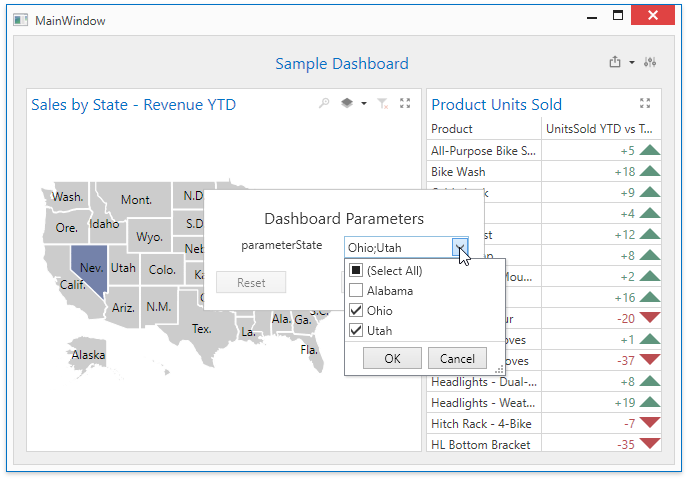

<!-- default badges list -->

<!-- default badges end -->

# Dashboard for WPF - How to Manage Dashboard Parameters in Code 

This example shows how to change a default or user-defined [dashboard parameter](https://docs.devexpress.com/Dashboard/400012) value in the [`DashboardControl.CustomParameters`](https://docs.devexpress.com/Dashboard/DevExpress.DashboardWpf.DashboardControl.CustomParameters) event handler. The effective parameter value is hidden from users. Set the [`Visible`](https://docs.devexpress.com/Dashboard/DevExpress.DashboardCommon.DashboardParameter.Visible) property to `false` to hide the parameter from the **Dashboard Parameters** dialog.

In this example, the **parameterState** dashboard parameter with static look-up settings is added to the dashboard. This dashboard parameter is used to filter the data source. The [Dashboard Parameters](https://docs.devexpress.com/Dashboard/400012) dialog displays the values and enables users to select a parameter value from the list. In the [`DashboardControl.CustomParameters`](https://docs.devexpress.com/Dashboard/DevExpress.DashboardWpf.DashboardControl.CustomParameters) event handler, we can change the value supplied by the user before it is passed to the query.
In the result, the value defined in the `DashboardControl.CustomParameters` event is in effect.

## Files to Review

* [MyViewModel.cs](./cs/WPF_Dashboard_CustomParameters/ViewModels/MyViewModel.cs) (VB: [MyViewModel.vb](./VB/WPF_Dashboard_CustomParameters/ViewModels/MyViewModel.vb))
* [MyDashboardView.xaml.cs](./cs/WPF_Dashboard_CustomParameters/Views/MyDashboardView.xaml.cs) (VB: [MyDashboardView.xaml.vb](./VB/WPF_Dashboard_CustomParameters/Views/MyDashboardView.xaml.vb))
* [MyDashboardView.xaml](./cs/WPF_Dashboard_CustomParameters/Views/MyDashboardView.xaml) (VB: [MyDashboardView.xaml](./VB/WPF_Dashboard_CustomParameters/Views/MyDashboardView.xaml))

## Documentation

- [Specify Dashboard Parameter Values](https://docs.devexpress.com/Dashboard/400012/wpf-viewer/manage-dashboard-parameters)
